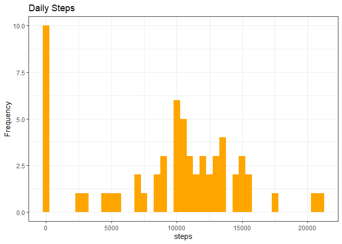
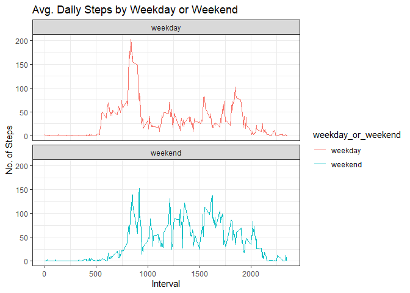

## Loading and preprocessing the data

It is now possible to collect a large amount of data about personal movement using activity monitoring devices such as a Fitbit, Nike Fuelband, or Jawbone Up. These type of devices are part of the “quantified self” movement – a group of enthusiasts who take measurements about themselves regularly to improve their health, to find patterns in their behavior, or because they are tech geeks. But these data remain under-utilized both because the raw data are hard to obtain and there is a lack of statistical methods and software for processing and interpreting the data.

This assignment makes use of data from a personal activity monitoring device. This device collects data at 5 minute intervals through out the day. The data consists of two months of data from an anonymous individual collected during the months of October and November, 2012 and include the number of steps taken in 5 minute intervals each day.

The data for this assignment can be downloaded from the course web site:

* Dataset: [Activity monitoring data](https://d396qusza40orc.cloudfront.net/repdata%2Fdata%2Factivity.zip) 

The variables included in this dataset are:

steps: Number of steps taking in a 5-minute interval (missing values are coded as 𝙽𝙰) </br>
date: The date on which the measurement was taken in YYYY-MM-DD format </br>
interval: Identifier for the 5-minute interval in which measurement was taken </br>
The dataset is stored in a comma-separated-value (CSV) file and there are a total of 17,568 observations in this dataset. 


## What is mean total number of steps taken per day?


```r
library(dplyr)
```

```
## 
## Attaching package: 'dplyr'
```

```
## The following objects are masked from 'package:stats':
## 
##     filter, lag
```

```
## The following objects are masked from 'package:base':
## 
##     intersect, setdiff, setequal, union
```

```r
library(ggplot2)
```
## Reading csv Data into data.frame 


```r
activityDT <- read.csv("data/activity.csv")
```


## What is the average daily activity pattern?

1. Calculate the total number of steps taken per day


```r
Total_steps <- group_by(activityDT, date) %>%
               summarize(steps=sum(steps, na.rm = FALSE)) %>%
               unique()
```
2. Histogram of the total number of steps taken each day


```r
ggplot(Total_steps, aes(x = steps)) +
  geom_histogram( fill = "orange", binwidth = 500) +
  labs(title = "Daily Steps", x = "steps", y= "Frequency") + 
  scale_fill_brewer(palette="BrBG") +
  theme_bw() + guides(fill=FALSE)
```

```
## Warning: Removed 8 rows containing non-finite values (stat_bin).
```

<!-- -->

3. Mean and median number of steps taken each day


```r
Total_steps %>%
  summarise(Mean_Steps = mean(steps, na.rm = TRUE)
            , Median_Steps = median(steps, na.rm = TRUE) )
```

```
## # A tibble: 1 x 2
##   Mean_Steps Median_Steps
##        <dbl>        <int>
## 1     10766.        10765
```

4. Time series plot of the average number of steps taken


```r
IntervalDT  <- group_by(activityDT, interval) %>%
               summarize(steps=mean(steps, na.rm = TRUE)) %>%
               unique()
```

Plotting data to chart


```r
ggplot(IntervalDT, aes(x = interval, y = steps)) +
  geom_line(color="black", size=0.5) +
  labs(title = "Avg. Daily Steps", x = "Interval", y = "Avg. steps per day") +        
  scale_fill_brewer(palette="BrBG") +
  theme_bw() + guides(fill=FALSE)
```

<!-- -->

5. The 5-minute interval that, on average, contains the maximum number of steps


```r
filter(IntervalDT, steps==max(steps)) %>%
       mutate(max_interval = interval) %>%
       select(max_interval) 
```

```
## # A tibble: 1 x 1
##   max_interval
##          <int>
## 1          835
```


## Imputing missing values

1. Calculate and report the total number of missing values in the dataset (i.e. the total number of rows with 𝙽𝙰s)


```r
sum(is.na(activityDT$steps)) 
```

```
## [1] 2304
```
2. Devise a strategy for filling in all of the missing values in the dataset. The strategy does not need to be sophisticated. For example, you could use the mean/median for that day, or the mean for that 5-minute interval, etc.

3.Create a new dataset that is equal to the original dataset but with the missing data filled in.


```r
# Filling in missing values with median of dataset. 

# to get median value from column "steps" for value is not NA, then assign to a variable

sort(activityDT$steps,decreasing = FALSE) %>%
  median(activityDT$steps, na.rm = TRUE)
```

```
## [1] 0
```

```r
int_MedianSteps <- filter(activityDT, (!is.na(steps & steps==median(steps)))) %>%
                    head(n=1) %>%
                    select(steps) %>%
                    as.numeric()


# replace NA value by median value and create a tidy dataset
tidyDT <- mutate(activityDT, steps = tidyr::replace_na(steps, int_MedianSteps))
```


```r
write.csv(tidyDT, "data/tidyData.csv")
```

4. Make a histogram of the total number of steps taken each day and Calculate and report the mean and median total number of steps taken per day. Do these values differ from the estimates from the first part of the assignment? What is the impact of imputing missing data on the estimates of the total daily number of steps?


```r
# total number of steps taken per day
Total_steps_2 <- group_by(tidyDT, date) %>%
                 summarize(steps=sum(steps, na.rm = TRUE)) %>%
                 unique()

# mean and median total number of steps taken per day
Total_steps_2 %>%
             summarise(Mean_Steps = mean(steps, na.rm = TRUE)
            , Median_Steps = median(steps, na.rm = TRUE) )
```

```
## # A tibble: 1 x 2
##   Mean_Steps Median_Steps
##        <dbl>        <dbl>
## 1      9354.        10395
```

```r
ggplot(Total_steps_2, aes(x = steps)) +
  geom_histogram( fill = "orange", binwidth = 500) +
  labs(title = "Daily Steps", x = "steps", y= "Frequency") + 
  scale_fill_brewer(palette="BrBG") +
  theme_bw() + guides(fill=FALSE)
```

<!-- -->


|Type of Estimate | Mean_Steps | Median_Steps |
|:-------: | :-------: | -------:|
|First Part (with na) | 10,765 | 10,765|
|Second Part (filled in na with median) | 9,354.23 | 10,395|


## Are there differences in activity patterns between weekdays and weekends?

1. Create a new factor variable in the dataset with two levels – “weekday” and “weekend” indicating whether a given date is a weekday or weekend day.


```r
# recreating activityDT from scratch then making the new factor variable to ensure data consistency 
library(data.table)
```

```
## 
## Attaching package: 'data.table'
```

```
## The following objects are masked from 'package:dplyr':
## 
##     between, first, last
```

```r
activityDT <- read.csv("data/activity.csv")

# creating new column "Day_of_Week" (e.g. Monday, Tuesday ...)
activityDT <- mutate(activityDT,Day_of_Week = weekdays(as.POSIXct(date, format = "%Y-%m-%d")))

# creating new column "weekday_or_weekend" to define weekday & weekend group of each observation.
activityDT <- activityDT %>%
  mutate(weekday_or_weekend = 
        ifelse(Day_of_Week %in% c("Monday","Tuesday","Wednesday","Thursday","Friday"), "weekday",
        ifelse(Day_of_Week %in% c("Saturday","Sunday"), "weekend","NA")))

activityDT$weekday_or_weekend <- as.factor(activityDT$weekday_or_weekend)

head(activityDT, 5)
```

```
##   steps       date interval Day_of_Week weekday_or_weekend
## 1    NA 2012-10-01        0      Monday            weekday
## 2    NA 2012-10-01        5      Monday            weekday
## 3    NA 2012-10-01       10      Monday            weekday
## 4    NA 2012-10-01       15      Monday            weekday
## 5    NA 2012-10-01       20      Monday            weekday
```

2. Make a panel plot containing a time series plot (i.e. 𝚝𝚢𝚙𝚎 = "𝚕") of the 5-minute interval (x-axis) and the average number of steps taken, averaged across all weekday days or weekend days (y-axis). See the README file in the GitHub repository to see an example of what this plot should look like using simulated data.


```r
# to get median value from column "steps" for value is not NA, then assign to a variable

sort(activityDT$steps,decreasing = FALSE) %>%
  median(activityDT$steps, na.rm = TRUE)
```

```
## [1] 0
```

```r
int_MedianSteps <- filter(activityDT, (!is.na(steps & steps==median(steps)))) %>%
                    head(n=1) %>%
                    select(steps) %>%
                    as.numeric()

# replace NA value by median value and create a tidy dataset
tidyDT <- mutate(activityDT, steps = tidyr::replace_na(steps, int_MedianSteps))

intervalDT <- group_by(tidyDT, interval,weekday_or_weekend ) %>%
  summarize(Meansteps = mean(steps))
```

```
## `summarise()` has grouped output by 'interval'. You can override using the `.groups` argument.
```

```r
ggplot(intervalDT, aes(x = interval, y= Meansteps, color = weekday_or_weekend)) +
  geom_line() +
  labs(title = "Avg. Daily Steps by Weekday or Weekend", x = "Interval", y= "No. of Steps") +
  facet_wrap(~weekday_or_weekend , ncol = 1, nrow=2) +
  scale_fill_brewer(palette="BrBG") +
  theme_bw() + guides(fill=FALSE)
```

<!-- -->


