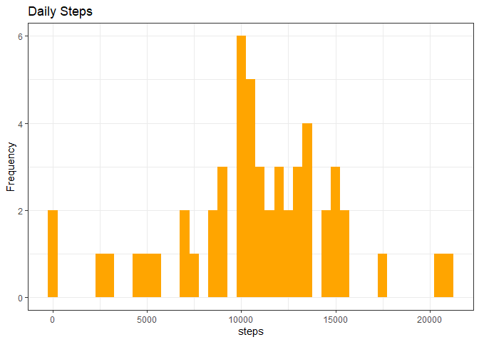
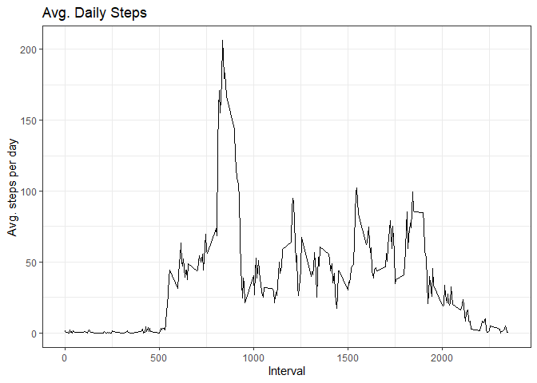

## Loading and preprocessing the data

It is now possible to collect a large amount of data about personal movement using activity monitoring devices such as a Fitbit, Nike Fuelband, or Jawbone Up. These type of devices are part of the “quantified self” movement – a group of enthusiasts who take measurements about themselves regularly to improve their health, to find patterns in their behavior, or because they are tech geeks. But these data remain under-utilized both because the raw data are hard to obtain and there is a lack of statistical methods and software for processing and interpreting the data.

This assignment makes use of data from a personal activity monitoring device. This device collects data at 5 minute intervals through out the day. The data consists of two months of data from an anonymous individual collected during the months of October and November, 2012 and include the number of steps taken in 5 minute intervals each day.

The data for this assignment can be downloaded from the course web site:

* Dataset: [Activity monitoring data](https://d396qusza40orc.cloudfront.net/repdata%2Fdata%2Factivity.zip) 

The variables included in this dataset are:

steps: Number of steps taking in a 5-minute interval (missing values are coded as 𝙽𝙰) </br>
date: The date on which the measurement was taken in YYYY-MM-DD format </br>
interval: Identifier for the 5-minute interval in which measurement was taken </br>
The dataset is stored in a comma-separated-value (CSV) file and there are a total of 17,568 observations in this dataset. 


## What is mean total number of steps taken per day?


```r
library(dplyr)
```

```
## 
## Attaching package: 'dplyr'
```

```
## The following objects are masked from 'package:stats':
## 
##     filter, lag
```

```
## The following objects are masked from 'package:base':
## 
##     intersect, setdiff, setequal, union
```

```r
library(ggplot2)
library(data.table)
```

```
## 
## Attaching package: 'data.table'
```

```
## The following objects are masked from 'package:dplyr':
## 
##     between, first, last
```
## Reading csv Data into data.frame 


```r
activityDT <- read.csv("data/activity.csv")

head(activityDT)
```

```
##   steps       date interval
## 1    NA 2012-10-01        0
## 2    NA 2012-10-01        5
## 3    NA 2012-10-01       10
## 4    NA 2012-10-01       15
## 5    NA 2012-10-01       20
## 6    NA 2012-10-01       25
```

```r
str(activityDT)
```

```
## 'data.frame':	17568 obs. of  3 variables:
##  $ steps   : int  NA NA NA NA NA NA NA NA NA NA ...
##  $ date    : chr  "2012-10-01" "2012-10-01" "2012-10-01" "2012-10-01" ...
##  $ interval: int  0 5 10 15 20 25 30 35 40 45 ...
```


## What is the average daily activity pattern?

1. Calculate the total number of steps taken per day


```r
Total_steps <- group_by(activityDT, date) %>%
               summarize(steps=sum(steps, na.rm = TRUE)) %>%
               unique()

head(Total_steps, 10)
```

```
## # A tibble: 10 x 2
##    date       steps
##    <chr>      <int>
##  1 2012-10-01     0
##  2 2012-10-02   126
##  3 2012-10-03 11352
##  4 2012-10-04 12116
##  5 2012-10-05 13294
##  6 2012-10-06 15420
##  7 2012-10-07 11015
##  8 2012-10-08     0
##  9 2012-10-09 12811
## 10 2012-10-10  9900
```
2. Histogram of the total number of steps taken each day


```r
ggplot(Total_steps, aes(x = steps)) +
  geom_histogram( fill = "orange", binwidth = 500) +
  labs(title = "Daily Steps", x = "steps", y= "Frequency") + 
  scale_fill_brewer(palette="BrBG") +
  theme_bw() + guides(fill=FALSE)
```

<!-- -->
3. Mean and median number of steps taken each day


```r
Total_steps$Mean_Steps <- mean(Total_steps$steps, na.rm = TRUE)
Total_steps$Median_Steps <- median(Total_steps$steps, na.rm = TRUE)
                    
head(Total_steps, 10)
```

```
## # A tibble: 10 x 4
##    date       steps Mean_Steps Median_Steps
##    <chr>      <int>      <dbl>        <int>
##  1 2012-10-01     0      9354.        10395
##  2 2012-10-02   126      9354.        10395
##  3 2012-10-03 11352      9354.        10395
##  4 2012-10-04 12116      9354.        10395
##  5 2012-10-05 13294      9354.        10395
##  6 2012-10-06 15420      9354.        10395
##  7 2012-10-07 11015      9354.        10395
##  8 2012-10-08     0      9354.        10395
##  9 2012-10-09 12811      9354.        10395
## 10 2012-10-10  9900      9354.        10395
```

4. Time series plot of the average number of steps taken


```r
IntervalDT  <- group_by(activityDT, interval) %>%
               summarize(steps=mean(steps, na.rm = TRUE)) %>%
               unique()

head(IntervalDT, 10)
```

```
## # A tibble: 10 x 2
##    interval  steps
##       <int>  <dbl>
##  1        0 1.72  
##  2        5 0.340 
##  3       10 0.132 
##  4       15 0.151 
##  5       20 0.0755
##  6       25 2.09  
##  7       30 0.528 
##  8       35 0.868 
##  9       40 0     
## 10       45 1.47
```

Plotting data to chart


```r
ggplot(IntervalDT, aes(x = interval, y = steps)) +
  geom_line(color="black", size=0.5) +
  labs(title = "Avg. Daily Steps", x = "Interval", y = "Avg. steps per day") +        
  scale_fill_brewer(palette="BrBG") +
  theme_bw() + guides(fill=FALSE)
```

<!-- -->
5. The 5-minute interval that, on average, contains the maximum number of steps


```r
filter(IntervalDT, steps==max(steps)) %>%
       mutate(max_interval = interval) %>%
       select(max_interval) %>%
       print()
```

```
## # A tibble: 1 x 1
##   max_interval
##          <int>
## 1          835
```


## Imputing missing values


## Are there differences in activity patterns between weekdays and weekends?


```r
# CLEAN UP #################################################

# Clear data
rm(list = ls())  # Removes all objects from environment


# Clear plots
graphics.off()  # Clears plots, closes all graphics devices

# Clear console
cat("\014")  # Mimics ctrl+L
```



```r
# Clear mind :)
```


